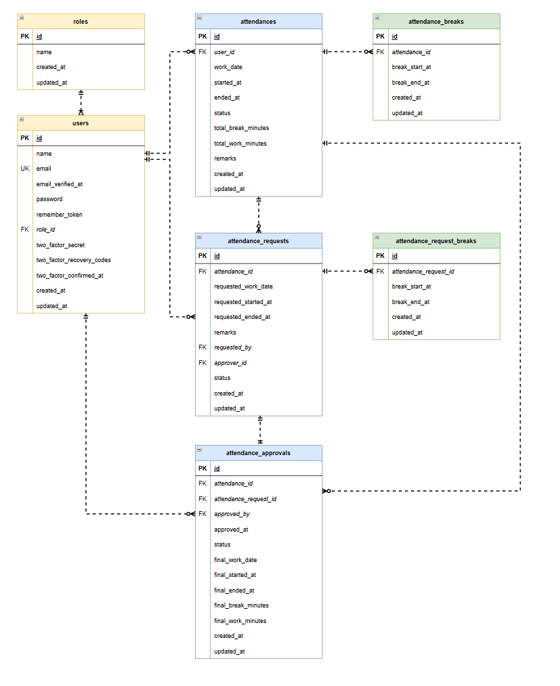

# 勤怠管理システム（attendance-system）

Laravel を使用した勤怠管理アプリケーションです。Docker を使用して開発環境を構築します。

## 使用技術

### フロントエンド・バックエンド

- **PHP**: 8.1
- **Framework**: Laravel 8.x

### インフラ・データベース

- **Docker / Docker Compose**
- **Web Server**: Nginx
- **Database**: MySQL 8.0
- **Database Management**: phpMyAdmin

## ER 図



## 環境構築手順

### 前提条件

- Docker Desktop (または Docker Engine + Docker Compose) がインストールされていること。

### 構築ステップ

1. **リポジトリのクローン**

   ローカルにディレクトリを作成のうえ、ディレクトリ上で下記コマンドを実行します。

   ```bash
   git clone git@github.com:nyomya7952-boop/attendance-system.git
   ```

2. **環境設定ファイルの作成**

   attendance-systemディレクトリ上で、`src` ディレクトリにある `.env.example` をコピーして `.env` を作成します。

   Linux/Mac:

   ```bash
   cp src/.env.example src/.env
   ```

   `src/.env` をエディタで開き、下記の通り修正します。

   ```ini
   // データベース設定（`docker-compose.yml` の設定に合わせて修正）
   DB_CONNECTION=mysql
   DB_HOST=mysql
   DB_PORT=3306
   DB_DATABASE=laravel_db
   DB_USERNAME=laravel_user
   DB_PASSWORD=laravel_pass
   ```

   ```ini
   // メール認証設定
   MAIL_MAILER=smtp
   MAIL_HOST=mailhog
   MAIL_PORT=1025
   MAIL_USERNAME=null
   MAIL_PASSWORD=null
   MAIL_ENCRYPTION=null
   MAIL_FROM_ADDRESS="noreply@example.com"
   MAIL_FROM_NAME="${APP_NAME}"
   ```

   ※ .env ファイルは Git 管理対象外です。

3. **Docker コンテナの起動**

   プロジェクトルートで以下のコマンドを実行します。

   ```bash
   docker-compose up -d --build
   ```

4. **依存関係のインストールとセットアップ**

   PHP コンテナに入り、Composer パッケージのインストールと Laravel の初期設定を行います。

   ```bash
   docker-compose exec php bash
   ```

   コンテナ内で以下を実行します:

   ```bash
   # 依存ライブラリのインストール
   composer install

   # アプリケーションキーの生成
   php artisan key:generate

   # データベースのマイグレーション
   php artisan migrate

   # シーダーの実行
   php artisan db:seed
   ```

   完了したら `exit` でコンテナから抜けます。

5. **アプリケーションへのアクセス**

   ブラウザで以下の URL にアクセスして確認します。
   - **アプリケーション(一般ユーザ)**: [http://localhost/login](http://localhost/login)
   - **アプリケーション(管理者ユーザ)**: [http://localhost/admin/login](http://localhost/admin/login)
   - **phpMyAdmin**: [http://localhost:8080](http://localhost:8080)

   ※error で画面を開けない場合、下記コマンドを実行してください。

   ```bash
   sudo chmod -R 777 src/*
   ```

## PHPUnit テスト手順

1. **テスト用データベースの作成**

   mysql コンテナ上で下記コマンドを実行します。

   ```bash
   # 依存ライブラリのインストール
   mysql -u root -p
   CREATE DATABASE demo_test;

   # demo_testが作成されていることを確認
   SHOW DATABASES;
   ```

2. **設定ファイルの作成**

   attendance-systemディレクトリ上で、`src` ディレクトリにある `.env` をコピーして `.env.testing` を作成します。

   Linux/Mac:

   ```bash
   cp src/.env src/.env.testing
   ```

   `src/.env.testing` をエディタで開き、下記の通り修正します。

   ```ini
   APP_ENV=test
   APP_KEY=
   ```

   ※APP_KEY は空を設定する

   ```ini
   // データベース設定
   DB_CONNECTION=mysql_test
   DB_HOST=mysql
   DB_PORT=3306
   DB_DATABASE=demo_test
   DB_USERNAME=root
   DB_PASSWORD=root
   ```

   設定後、下記コマンドを実行します。

   ```bash
   php artisan key:generate --env=testing
   php artisan config:clear
   php artisan migrate --env=testing
   ```

3. **PHPUnit の実行**

   php コンテナで下記コマンドを実行します。

   ```bash
   php artisan test
   ```
